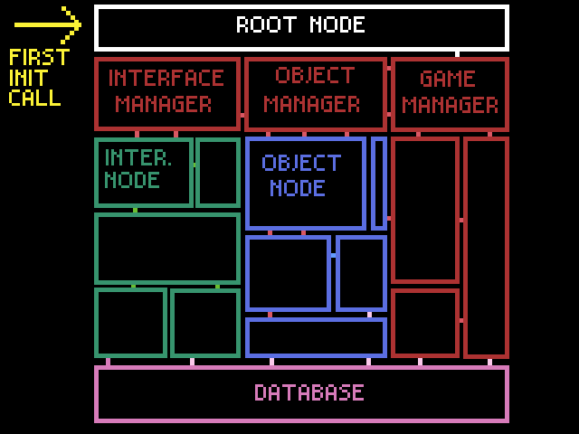

# DESIGN

## High-Level overview 
For the architecture of this project, I'm combining the node-based system of Godot (every object is a node in a tree) with 
Jonas Tyroller's Database-Module-Glue system outlined in [this video](https://www.youtube.com/watch?v=8WqYQ1OwxJ4).

This means that everything running in the game will be an instance of an object whose class is descended from a generic "Node" class. 
Furthermore, each node will be a child of another node, save the root node, which is _always_ be a generic Node object, which 
exists solely for the purposes of beginning execution. 

On a broader level, nodes will be divided into three types: 
- Manager nodes, which are not drawn and exist solely to preform behind-the-scenes logic, i.e. moving the game state from the paused to unpaused. 
- Object nodes, which are drawn and represent diegetic aspects of the game world. If it has physics/collisions, it's an object node. 
- Interface nodes, which are drawn but represent non-diegetic aspects of the game world. The UI is made up entirely of interface nodes. (This will *hopefully* be implemented with the CLAY library)

Runtime nodes will be executed on top of a database, which stores all immutable data. The implementation has yet to be learned. 

### Visual Representation 

